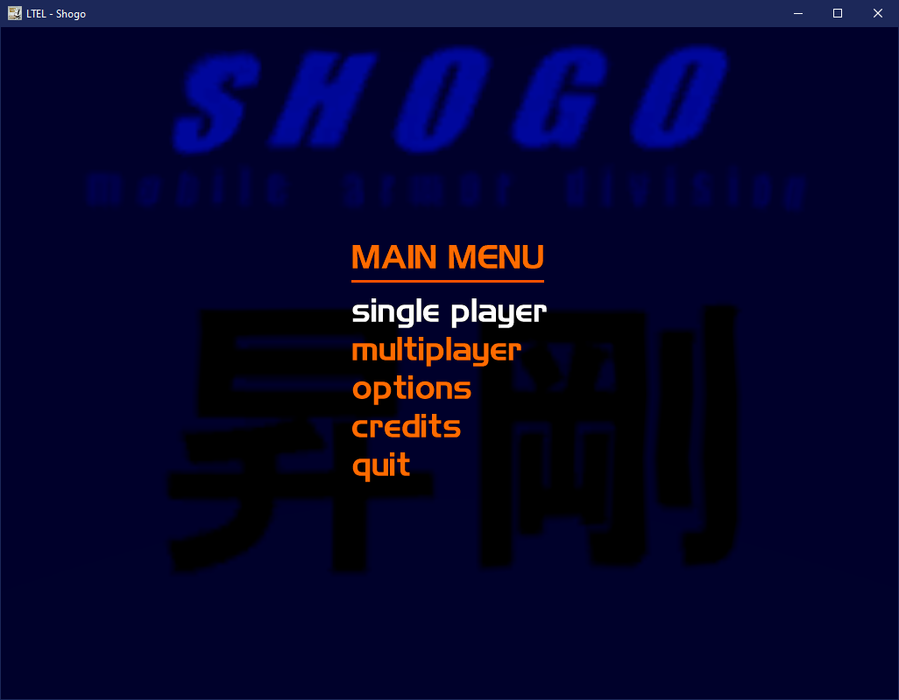

# Lithtech Engine Link (LTEL)
This is a prototype of a possible engine replacement for Lithtech 1.0 games (Shogo, and Blood 2.) This is far from usable, and I'm mostly throwing stuff on the wall to see how it behaves.

## Instructions
Clone https://github.com/godotengine/godot-cpp into the `./godot-cpp`, you'll need python and scons (you can install that through pip, python's package manager.)

Once python and scons are installed cd into `godot-cpp` and run `scons platform=windows generate_bindings=yes bits=32`. You'll need 32-bit because the game code currently only compiles into a 32-bit dll.

Then you should be able to compile a debug build of LTEL.dll, the post-build event should automatically move it into the godot-proj's bin folder. You'll need to adjust the debug target to your 32-bit install of godot.

## Status

SHOGO boots up to menu, and displays the majority of menu items. 

Blood 2 does not boot due to some unimplemented shared libraries.